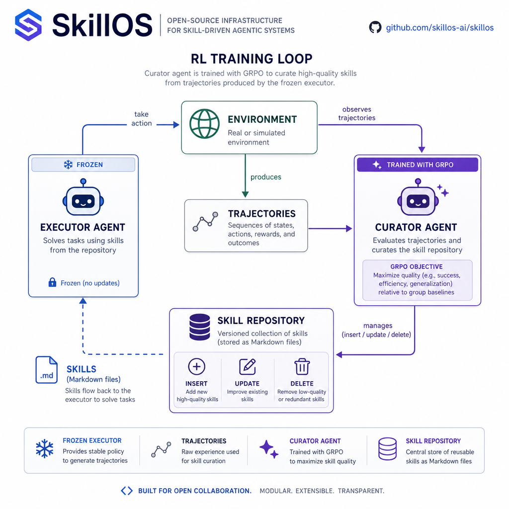

# SkillOS

PyTorch implementation of ["SkillOS: Learning Skill Curation for Self-Evolving Agents"](https://arxiv.org/abs/2605.06614) (Google Cloud AI Research + UIUC + MIT, 2026) using [HuggingFace TRL](https://github.com/huggingface/trl). The paper has no official code release - this repo provides a clean, reproducible implementation with open weights.

**The paper's key result:** An RL-trained 8B curator outperforms Gemini-2.5-Pro at skill curation across every benchmark. Targeted training on curation decisions beats raw model scale - meaning better agent memory management on consumer hardware than frontier API models.

## How It Works

<p align="center">
  
</p>

1. **Frozen executor** solves tasks using retrieved skills (never trained, just inference)
2. **Curator** (the model we train) observes trajectories and manages the skill repo via tool calls
3. **GRPO** optimizes the curator based on whether its curation decisions help future tasks
4. **Composite reward:** task outcome + valid function calls + content quality + compression
5. Skills are markdown with YAML frontmatter, the format used by [Anthropic](https://docs.anthropic.com/en/docs/agents/skills), [belt](https://belt.sh), and others

## Quick Start

```bash
# Install
pip install -e ".[dev]"

# Download ALFWorld data
alfworld-download -f
export ALFWORLD_DATA=~/.cache/alfworld

# Smoke test - verify all dependencies load
python -m skillos.smoke_test

# Train curator (single GPU, LoRA, heuristic executor)
python -m skillos.train --config configs/alfworld_single_gpu.yaml
```

## Target Results

Reproducing Table 1 from the paper (Qwen3-8B executor):

| Method | Curator | Pick | Look | Clean | Heat | Cool | Pick2 | **Avg SR** | Steps |
|---|---|---|---|---|---|---|---|---|---|
| No Memory (paper) | - | 78.1 | 46.2 | 33.3 | 37.5 | 29.3 | 47.2 | 47.9 | 21.1 |
| SkillOS (paper) | Qwen3-8B | - | - | - | - | - | - | **61.2** | **18.9** |
| No Memory (ours) | - | 60 | 46 | 19 | 25 | 20 | 25 | 33.6 | - |
| SkillOS (ours, ckpt30) | Qwen3-8B | 66 | 46 | 41 | 12 | 44 | 29 | **42.9** | - |

**Status (2026-06-21):** first faithful Algorithm 1 run (`algo1v8lorakl`)
completed the full 60-step schedule. Held-out lift is **significant at ckpt30:
+9.3pp over the no-memory baseline (p=0.035, paired McNemar, n=140)** — ~70% of
the paper's lift. Two open gaps: (1) our no-memory **baseline is 14pp below the
paper** (33.6 vs 47.9) — traced to the zero-shot executor ignoring ALFWorld's
atomic `heat/cool/clean` verbs; a one-line prompt hint did **not** close it at
scale (still open); (2) our checkpoint trajectory is **bimodal** (peaks at
ckpt30) rather than the paper's monotone-to-60, likely the small effective batch
+ TRL-vs-verl framework swap. Full narrative in [`JOURNAL.md`](JOURNAL.md).

## Project Structure

```
skillos/
  envs/
    curator_env.py     # Curator's environment: runs frozen executor, exposes skill tools
    alfworld.py        # ALFWorld as standalone TRL environment
  executor/
    executor.py        # Pluggable frozen executor (heuristic / local / vLLM / API)
  curator/
    model.py           # Parse curator tool calls, apply to skill repo
    prompts.py         # All prompts verbatim from paper Appendix A
  skills/
    repo.py            # Markdown skill store + BM25 retrieval
  rewards/
    composite.py       # r = r_task + r_fc + r_cnt + r_comp (Eq. 1)
    judge.py           # Pluggable content quality judge (heuristic / local / vLLM / API)
  data/
    grouping.py        # Grouped task stream construction
  train.py             # Main training script (trains curator, not executor)
  smoke_test.py        # Verify setup
configs/
  alfworld_env.yaml            # ALFWorld environment config
  alfworld_single_gpu.yaml     # Single GPU training (LoRA)
  alfworld_multi_gpu.yaml      # Multi GPU (matches paper)
```

## Pluggable Backends

Both the frozen executor and content quality judge support multiple backends:

```yaml
# Frozen executor (generates trajectories for curator to learn from)
executor:
  type: heuristic  # No model - pipeline validation (default)
  # type: local     # Local transformers model
  # model: Qwen/Qwen3-8B
  # type: vllm      # vLLM server on dedicated GPU
  # base_url: http://localhost:8002/v1
  # type: api       # Any OpenAI-compatible API
  # base_url: https://api.inference.sh/v1
  # type: infsh     # inference.sh app via the inferencesh Python SDK
  # app: openrouter/qwen3-8b

# Content quality judge (r_cnt reward component, paper uses Qwen3-32B)
judge:
  type: heuristic  # Rule-based, no model (default)
  # type: vllm
  # base_url: http://localhost:8001/v1
  # model: Qwen/Qwen3-32B
  # type: api
  # base_url: https://api.inference.sh/v1
  # type: infsh
  # app: openrouter/qwen3-32b
```

| Setup | Curator | Executor | Judge |
|---|---|---|---|
| Pipeline validation | CPU/small GPU | heuristic | heuristic |
| Single GPU | vLLM colocate + LoRA | local (same model) | heuristic |
| Multi-GPU (paper) | GPU 0 | vLLM on GPU 1 | vLLM on GPU 2 |
| API-offloaded | local GPU | [inference.sh](https://inference.sh) API | [inference.sh](https://inference.sh) API |

### Running executor + judge on inference.sh

Train the curator locally while the frozen executor and content judge run on
[inference.sh](https://inference.sh) — frees 100% of local VRAM for the model being trained.

```bash
# One-time: stash your inference.sh API key (managed by the belt CLI: https://belt.sh)
belt login --key <YOUR_INFERENCE_SH_KEY>

# Paper-faithful: Qwen3-8B executor + Qwen3-32B judge via the inferencesh SDK
python -m skillos.train --config configs/alfworld_paper.yaml
```

Key resolution order: explicit `api_key` in config → `INFSH_API_KEY` env var →
`INFERENCESH_API_KEY` env var → `~/.inferencesh/config.json` (written by `belt
login`) → `.env` file in the project root. Whatever you prefer.

## Roadmap

### v0.1 - Reproduce SkillOS on ALFWorld (in progress)

Reproduce the paper's core result: an RL-trained 8B curator that manages a skill repo for a frozen executor.

- [x] ALFWorld environment wrapped as TRL `environment_factory`
- [x] BM25 skill retrieval + markdown skill store
- [x] Curator environment with insert/update/delete tool calling
- [x] Composite reward function (task + validity + quality + compression)
- [x] Pluggable executor backends (heuristic / local / vLLM / API)
- [x] Pluggable judge backends (heuristic / local / vLLM / API)
- [x] Full training loop completing on 8×H100 (LoRA r=32 + full fine-tune, vLLM colocate)
- [x] Full **Algorithm 1**: evolving |G|=10 task sequence (`curate_and_advance`),
  `r_task = mean success over positions 2..|G|` — paper-faithful, supersedes Path B
- [x] Streaming-curation eval harness + paired-by-gamefile McNemar (n=140)
- [x] **Held-out lift confirmed**: LoRA +9.3pp (p=0.035), FFT +10.7pp (p=0.032)
- [ ] Paper's soft-Jaccard attribute grouping + within-group curriculum (§3.2.1)
- [ ] Match paper's ALFWorld results (target: 61.2% SR; current best ~44%)

#### Active experiments & open questions (keep tracked)

- [x] **seed-2 FFT** (`algo1fftseed2`) — **CONFIRMED 2026-06-28**: bimodal shape
  reproduces; peak shifted step20→step35 (+13.6pp, p=0.0026). Shape generalizes
  across seeds, peak indices don't.
- [x] **Natural-distribution grouping** (DIVERGENCES #0) — **RESOLVED 2026-07-03,
  uniform WINS**: natural-frequency training kills the lift (no arm significant,
  best +5.7pp p=0.20) and does NOT flatten the oscillation. Balanced exposure to
  high-headroom types (Clean/Cool/Heat) is load-bearing. Keep uniform round-robin.
- [x] **Within-group curriculum** (easy→hard ordering, paper Table 5) —
  **RESOLVED 2026-07-09, no lift**: no arm significant (best +4.3pp p=0.36),
  flat oscillation, same signature as `natural`. With BOTH halves of #0 now
  falsified, grouping is fully exonerated as the bimodality driver; TRL≠verl
  (#14) is the last remaining suspect.
- [x] **Cross-executor transfer** (8B-trained curator → 32B executor) —
  **CONFIRMED 2026-07-04**: v8-LoRA ckpt30 lifts the 32B executor +12.9pp
  (p=0.0064), 62.1% absolute — above the paper's 61.2% headline. Transfer is
  artifact-dependent (FFT curators transfer weakly/not at all; the 8B ranking
  inverts).
- [ ] Baseline gap (~34% vs paper 47.9%) — **closed as 8B-specific** (decode +
  precision + prompt + retrieval ruled out; 32B reproduces 54.5%). Open question
  for the authors, not a bug. See `DIVERGENCES.md` #13.
- [ ] Writeup: `docs/repro_report.md` (findings) + `docs/training_notes.md`
  (engineering). Gate on multi-seed (above) + scope decision (ALFWorld-only vs +WebShop).

### v0.2 - Reasoning + Cross-Domain Transfer

- [ ] Reasoning environment (DeepMath-103K + GPQA-Diamond)
- [ ] Match reasoning results (target: 73.8% avg accuracy)
- [ ] Cross-domain transfer: reasoning-trained curator on ALFWorld (+13.3%)
- [ ] WebShop environment integration

### v0.3 - Open Weights

- [ ] Full training runs on all benchmarks
- [ ] Publish trained curator weights on HuggingFace
- [ ] Evaluation suite for comparing curator quality

### v1.0 - Production Curator

- [ ] Real-world trajectory extraction (long transcripts → structured traces)
- [ ] Curator serving via vLLM/Ollama
- [ ] Continuous training on user telemetry
- [ ] Integration with agent frameworks ([belt](https://github.com/belt-sh/cli), Claude Code, LangChain)

## Hardware Requirements

| Setup | Hardware | Use Case |
|---|---|---|
| Development | 1x RTX 6000 Pro (96GB) | Pipeline validation, small-batch training |
| Training | 2x H100 (80GB) | Full training with LoRA |
| Paper config | 16x H100 (80GB) | Full replication, 3-5 days |
| Inference only | Any GPU 8GB+ | Run trained curator in 4-bit quant |

## Stack

- **[TRL](https://github.com/huggingface/trl)** - GRPOTrainer with `environment_factory` for multi-turn RL
- **[vLLM](https://github.com/vllm-project/vllm)** - Fast inference during rollout generation
- **[Qwen3-8B](https://huggingface.co/Qwen/Qwen3-8B)** - Base model (Apache 2.0)
- **[ALFWorld](https://github.com/alfworld/alfworld)** - Household task environment
- **[rank-bm25](https://github.com/dorianbrown/rank_bm25)** - Skill retrieval

All components permissively licensed (Apache 2.0 / MIT). Trained models are fully commercial-use.

## References

- [SkillOS: Learning Skill Curation for Self-Evolving Agents](https://arxiv.org/abs/2605.06614) - Ouyang et al., 2026
- [GRPO: Group Relative Policy Optimization](https://arxiv.org/abs/2402.03300) - DeepSeek-Math, Shao et al., 2024
- [Anthropic SKILL.md format](https://docs.anthropic.com/en/docs/agents/skills)
- [belt CLI](https://github.com/belt-sh/cli) - Agent skill management

## License

Apache 2.0
