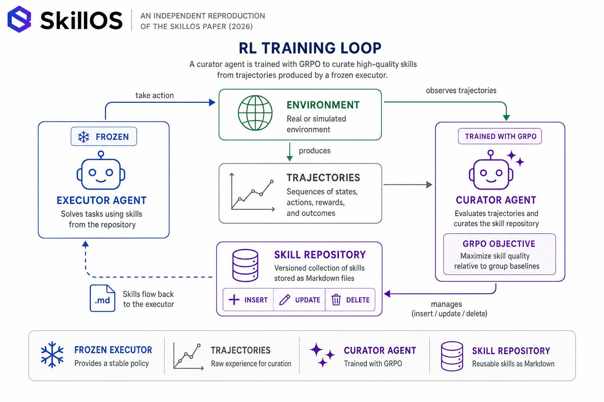

# SkillOS

Open reproduction of ["SkillOS: Learning Skill Curation for Self-Evolving Agents"](https://arxiv.org/abs/2605.06614) (Google Cloud AI Research + UIUC + MIT, 2026). The paper trains a curator with GRPO on 16 H100s using verl. We reproduced it on 8 H100s in **both** [TRL](https://github.com/huggingface/trl) and [verl-agent/GiGPO](https://github.com/langfengQ/verl-agent) — seven full 60-step training runs, ~2 months of box time — with all training and eval code, three benchmarks (ALFWorld + AIME + GPQA-Diamond), and every deviation logged.

Short version of what we found: the method works, the effect is smaller and far less stable than a single reported number suggests, it transfers better to a *bigger* executor than to the one it trained against, and the paper's cross-domain transfer claim comes out with the opposite sign. Details in [`docs/repro_report.md`](docs/repro_report.md).

<p align="center">
  
</p>

## Artifacts

Weights and every paired eval rollout are published, so nothing here has to be taken on trust:

| artifact | what it is |
|---|---|
| [`skillos-alfworld-eval-arms`](https://huggingface.co/datasets/inference-sh/skillos-alfworld-eval-arms) | **Start here.** 135 per-game eval JSONLs across 13 sweeps. Recompute every significance test in this repo on a laptop — no GPU, no API key. |
| [`skillos-curator-qwen3-8b-verl-gigpo`](https://huggingface.co/inference-sh/skillos-curator-qwen3-8b-verl-gigpo) | All 12 checkpoints of the verl/GiGPO run, in `step_N/` subfolders. The whole curve, because the curve *is* the finding. |
| [`skillos-curator-qwen3-8b-trl-fft`](https://huggingface.co/inference-sh/skillos-curator-qwen3-8b-trl-fft) | 7 selected TRL arms across 3 seeds — each seed's peak and final, plus `fft-seed3-step5`, the best 32B-transfer curator in the project. |

```python
from transformers import AutoModelForCausalLM, AutoTokenizer

# the best curator we trained, as measured on the executor you'd actually ship
name, sub = "inference-sh/skillos-curator-qwen3-8b-trl-fft", "fft-seed3-step5"
tok = AutoTokenizer.from_pretrained(name, subfolder=sub)
model = AutoModelForCausalLM.from_pretrained(name, subfolder=sub, dtype="bfloat16")
```

Before picking a checkpoint, read the model cards — **the final checkpoint is the worst one in every run**, the peak moves with the seed, and the best checkpoint on an 8B executor is often a poor one on a 32B executor. GPQA rollouts are deliberately absent from all of it (gated dataset; see [`data/README.md`](data/README.md)).

## What is SkillOS

The idea: freeze the executor (the agent that actually solves tasks), train only a **curator** (a separate LLM) whose job is to maintain a markdown skill repo. The curator writes/updates/deletes skills after each rollout via a `curate_and_advance` tool call. The executor retrieves the top-k relevant skills before each new task. GRPO optimises the curator against a composite reward: task success + valid tool calls + judge-scored content quality + repo compression.

Skill files are markdown with YAML frontmatter, the same format used by [Anthropic's Skills](https://docs.anthropic.com/en/docs/agents/skills) and the [belt CLI](https://github.com/belt-sh/cli).

## Headline results

Paired McNemar vs a no-memory baseline unless noted. Full write-up with figures in [`docs/repro_report.md`](docs/repro_report.md), narrative in [`JOURNAL.md`](JOURNAL.md), every deviation from the paper in [`DIVERGENCES.md`](DIVERGENCES.md).

**Cross-executor transfer (paper's generalisation claim) — the strongest result:**

| curator (8B-trained) → executor | abs SR | Δ vs no-memory | p (McNemar, n=140) |
|---|---|---|---|
| fft-seed3 ckpt5 → Qwen3-32B | **62.9%** | **+13.6pp** | **0.0043** |
| v8-lora ckpt30 → Qwen3-32B | 62.1% | +12.9pp | 0.0064 |
| paper headline (SkillOS, Qwen3-32B executor) | 61.2% | ~+13pp | — |

Reproduces at parity with the paper — baseline stochasticity is ~±4pp, so read this as "at parity", not "beats". The curious part is *which* checkpoint wins: `ckpt5`, five GRPO steps in, and one of the weakest arms on the 8B executor it trained against.

**Reasoning baselines (no-memory, Qwen3-8B executor):**

| dataset | ours | paper (Qwen3-8B) | delta |
|---|---|---|---|
| AIME24 | 22/30 = 73.3% | 76.0±6.9 | −2.7pp (0.4σ) |
| AIME25 | 18/30 = 60.0% | 71.1±10.7 | −11.1pp (1.0σ) |
| GPQA-Diamond | 118/198 = 59.6% | 61.8±1.1 | −2.2pp (2.0σ) |
| **average** | **64.3%** | **69.6±4.7** | **−5.3pp (1.1σ)** |

**ALFWorld baselines, same executor:**

| method | ours | paper | delta |
|---|---|---|---|
| No Memory | 33.6% | 47.9% | −14.3pp |
| SkillOS (best 8B curator, on 8B executor) | 47.1% (seed-2 ckpt35) | 61.2% | −14.1pp |

The −14pp baseline gap is **environment-specific**: same executor reproduces the paper on reasoning within noise, so the ALFWorld gap is the ReAct/atomic-verb interaction, not model quality. Details: [`DIVERGENCES.md`](DIVERGENCES.md) #13, gotcha `executor-atomic-verb-gap`.

## The training trajectory is non-monotone, and the peak moves

Held-out lift over 60 training steps, every-5 sweep vs the canonical 33.6% baseline:

| run | peak ckpt | peak lift | p | ckpt60 lift |
|---|---|---|---|---|
| v8 LoRA r=32 (TRL) | 30 | +9.3pp | 0.035 | +1.4pp |
| seed-1 FFT (seed=42)  | 20 | +10.7pp | 0.032 | +5.7pp |
| seed-2 FFT (seed=123) | 35 | **+13.6pp** | **0.0026** | +4.3pp |
| seed-3 FFT (seed=456) | 55 | +11.4pp | 0.011 | +3.6pp |
| verl/GiGPO (real env) | 30 | +7.1pp | 0.099 | +0.7pp |


Five independent runs. Every one has a significant-looking peak; no two peak in the same place; the curve crosses its own baseline repeatedly; and ckpt60 sits at or near baseline every time. The paper reports a monotone-to-60 curve. **Ship best-of-heldout from a sweep, not `checkpoint-60`** — and see the multiplicity warning above before believing any single arm, including these.

Falsified as causes of the shape, each with a full training run plus a 140-game sweep: LoRA vs full fine-tuning, uniform vs natural type distribution, easy→hard within-group curriculum (both halves of DIVERGENCES #0), and the RL framework itself (#14 — verl/GiGPO reproduces the oscillation). Since the verl run also used 2× the batch ([#15](DIVERGENCES.md), our error), small-effective-batch gradient noise is ruled out too. Nothing we varied removes it.

## Quick start

```bash
# Clone + install
git clone https://github.com/belt-sh/skillos && cd skillos
pip install -e ".[dev]"

# ALFWorld data (one-time)
alfworld-download -f
export ALFWORLD_DATA=~/.cache/alfworld

# Smoke: verify all deps + heuristic pipeline
python -m skillos.smoke_test

# Train (single GPU, LoRA, heuristic executor — no API needed)
python -m skillos.train --config configs/alfworld_single_gpu.yaml
```

Reasoning benchmark, no local GPU needed (executor is remote):

```bash
# GPQA-Diamond gated: hf auth login, then request access (see data/README.md)
python -m scripts.eval_reasoning --mode no_memory --dataset aime \
  --executor infsh --executor-app openrouter/qwen3-8b \
  --parallel 12 --out output/eval-reasoning/nomem_aime.jsonl
```

Paper-faithful full training (8×H100, executor + judge remote on inference.sh):

```bash
belt login --key <YOUR_INFERENCE_SH_KEY>   # from https://belt.sh
./run_algo1_fft.sh                          # FFT + ZeRO-3, ~70 min/step, 60 steps
# or LoRA:
./run_algo1_v8_lora_kl.sh                   # LoRA r=32, ~40 min/step
```

## Pluggable backends

Executor and judge both support four backends (heuristic / local / vLLM / inference.sh API):

```yaml
executor:
  type: infsh
  app: openrouter/qwen3-8b
  reasoning_effort: medium

judge:
  type: infsh
  app: openrouter/qwen3-32b
```

Full options and the config precedence chain: see any file under `configs/`.

## Project layout

```
skillos/
  algo1/env.py           # Algorithm 1: |G|=10 evolving task groups, mega-tool
  envs/curator_env.py    # Curator env: runs frozen executor, exposes skill tools
  envs/task_types.py     # ALFWorld task-type taxonomy (single source of truth)
  executor/executor.py   # Pluggable frozen executor (heuristic/local/vLLM/infsh)
  curator/prompts.py     # All prompts verbatim from paper Appendix A
  skills/repo.py         # Markdown skill store + BM25 retrieval
  rewards/composite.py   # r = r_task + λ_f r_fc + λ_u r_cnt + λ_c r_comp
  rewards/judge.py       # Pluggable content quality judge
  reasoning/             # AIME + GPQA eval harness (datasets, prompts, grading)
  train.py               # Path B training (legacy but working)
scripts/
  train_algo1.py         # Algorithm 1 training entrypoint
  eval_streaming_curation.py   # ALFWorld closed-loop eval (no_memory + closed_loop)
  eval_reasoning.py            # Reasoning eval (no_memory today; closed_loop stubbed)
  compare_eval_arms.py         # Paired McNemar comparator over any set of JSONLs
  {natural,curriculum,transfer}_sweep_supervisor.sh   # storm-resilient sweep runners
configs/
  accelerate_zero3.yaml
  alfworld_paper.yaml           # 8×H100 paper-faithful (remote executor + judge)
  alfworld_8xh100_algo1_fft.yaml     # canonical FFT config
  alfworld_8xh100_algo1_v8_lora_kl.yaml   # canonical LoRA config
  alfworld_single_gpu.yaml, alfworld_multi_gpu.yaml   # dev configs
docs/
  repro_report.md        # findings write-up
  training_notes.md      # engineering notes (ZeRO-2 hang, NCCL, storm handling)
  skillos_paper.md       # reconstructed paper text for cross-reference
legacy/                  # superseded launchers and configs, kept for provenance
```

## What's confirmed vs open

Full write-up with figures: [`docs/repro_report.md`](docs/repro_report.md).

**Read this first.** Across five ALFWorld sweeps we tested **50 checkpoint arms**
against one baseline. Family-wide Bonferroni puts the bar at p < 0.001; the best
arm anywhere in the project is p = 0.0026. **No same-executor ALFWorld lift
survives correction.** Individual runs each look like they found something; the
family says we found a noisy oscillation with a mean above zero. Treat every
per-run peak below as a selection statistic.

Confirmed:
- Algorithm 1 with paper-faithful reward composition, executor/judge/decoder settings, in **two** RL frameworks (TRL and verl-agent/GiGPO)
- Per-run peak held-out lift, ALFWorld: LoRA +9.3pp (p=0.035), FFT seed-1 +10.7pp (p=0.032), seed-2 +13.6pp (p=0.0026), seed-3 +11.4pp (p=0.011), verl/GiGPO +7.1pp (p=0.099) — see the caveat above
- **Non-monotone trajectory reproduced in 5 runs across 2 frameworks**: peak indices at ckpt 20/30/35/55, ckpt60 back at baseline. DIVERGENCES #14 (TRL≠verl) is **closed** — the oscillation is intrinsic to the method, not a framework artifact. Peak index is RNG-path-dependent.
- **The reward machinery is healthy** — within GRPO groups `r_task` supplies 78.9% of the reward variance the advantage sees, and all 80 logged groups had non-zero `r_task` variance. Task reward still only moved +0.035 (95% CI ±0.034) over 60 steps while policy entropy collapsed 0.139 → 0.035.
- Cross-executor transfer at parity with the paper: 8B-trained curator lifts a 32B executor to **62.9%** (+13.6pp, p=0.0043; paper reports 61.2%)
- **Curator quality does not transfer across executor scale**: pooled Pearson r = −0.20 over 24 checkpoint pairs, −0.68 within seed-2, where the on-8B peak transfers to −4.3pp on 32B. The best 32B curator is seed-3 **ckpt5** — five GRPO steps in. Sweep on your target executor.
- **Cross-domain transfer reverses sign vs the paper**: a reasoning-trained curator on ALFWorld scores −14 to −18pp (p ≤ 0.0005) at every checkpoint past step 40, against the paper's +13.3pp claim. These are the only results that survive multiplicity correction comfortably.
- Reasoning curator training is a **null** on same-domain eval (best ckpt30, −0.8pp vs the 61.2% aggregate baseline)
- Reasoning baselines reproduce the paper within 1.1σ on average across AIME24/25 + GPQA-D
- ALFWorld baseline gap is env-specific (the same executor matches the paper on reasoning)

Suggestive (directional, underpowered):
- **ALFWorld-curator → reasoning transfer is asymmetric**: fft-seed2 ckpt35 +6.7pp on AIME24+25, fft-seed3 ckpt55 −8.3pp, v8-lora ckpt30 −1.7pp. All n=60, all p > 0.2 — needs higher-n to establish.

Open:
- **WebShop untouched.** The paper's third benchmark; we deliberately skipped it once the cross-domain claim became testable via the reasoning→ALFWorld direction. The three-benchmark averages are therefore out of reach.
- **The 14pp 8B ALFWorld baseline gap** (33.6% vs the paper's 47.9%). Ruled out: prompt wording, retrieval, seeds, serving precision, decode parameters. Remaining suspect is the ReAct/atomic-verb interaction. DIVERGENCES #13.
- Higher-n everything — n=140 gives a ~±3pp noise floor, so the 7pp effects this method produces are inherently marginal at this sample size.

## Hardware

| setup | hardware | use case |
|---|---|---|
| smoke | 1× 8GB+ GPU | pipeline validation, heuristic executor |
| LoRA | 1× H100 (80GB) | single-GPU LoRA training |
| paper-faithful (TRL) | 8× H100 + inference.sh (remote 8B executor / 32B judge) | 60 GRPO steps |
| paper-faithful (verl/GiGPO) | same | 60 GRPO steps |
| paper original | 16× H100 (verl) | ~3 days claimed |

Measured wall time for 60 GRPO steps on 8×H100, per run (from checkpoint mtimes):

| run | wall | notes |
|---|---|---|
| ALFWorld, TRL FFT (×3 seeds) | **~2.9 days** each | |
| Reasoning, TRL FFT (DeepMath-103K) | **~2.1 days** | |
| ALFWorld, verl/GiGPO real env | **~10.2 days** | ~15,100 remote executor calls *per step* |

The verl run is 3.5× the TRL wall time for the same 60 steps: GiGPO drives full
ReAct episodes to 30 steps for every position of every group, so the step is
bounded by remote executor throughput, not by local GPU compute. The GPU update
phase is ~1.4% of wall — this workload is inference-bound end to end. Budget
accordingly before reproducing.

## Stack

- [TRL](https://github.com/huggingface/trl) — GRPOTrainer with `environment_factory`, multi-turn RL
- [vLLM](https://github.com/vllm-project/vllm) — colocate generation
- [Qwen3-8B](https://huggingface.co/Qwen/Qwen3-8B) — base curator (Apache 2.0)
- [ALFWorld](https://github.com/alfworld/alfworld) — household tasks
- [rank-bm25](https://github.com/dorianbrown/rank_bm25) — skill retrieval
- [inference.sh](https://inference.sh) — remote executor + judge

## References

- [SkillOS: Learning Skill Curation for Self-Evolving Agents](https://arxiv.org/abs/2605.06614) — Ouyang et al., 2026
- [GRPO: Group Relative Policy Optimization](https://arxiv.org/abs/2402.03300) — Shao et al., 2024
- [Anthropic SKILL.md format](https://docs.anthropic.com/en/docs/agents/skills)
- [belt CLI](https://github.com/belt-sh/cli) — agent skill management

## License

Apache 2.0
