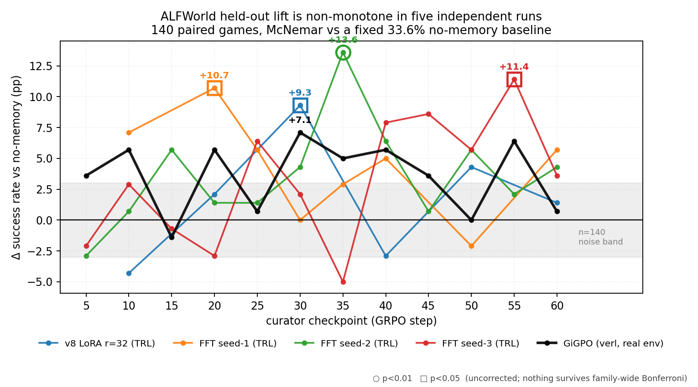
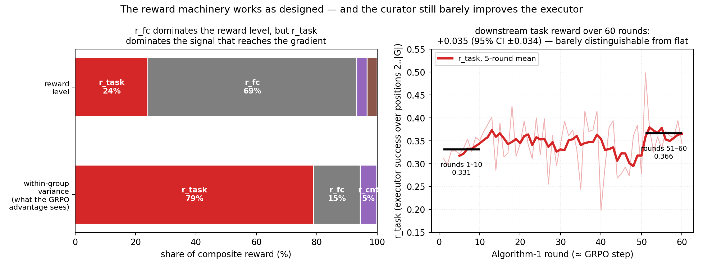
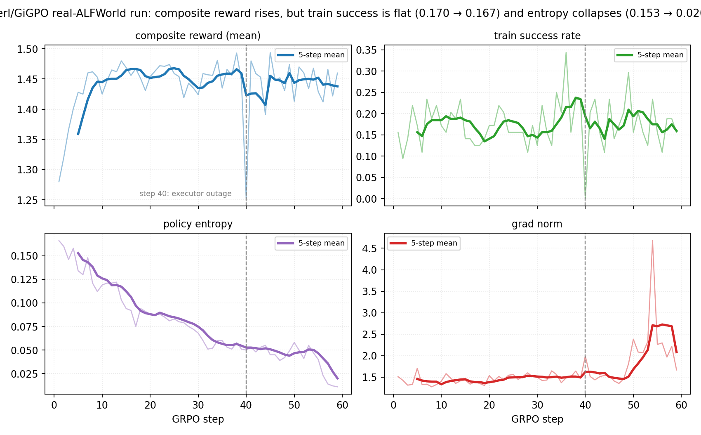
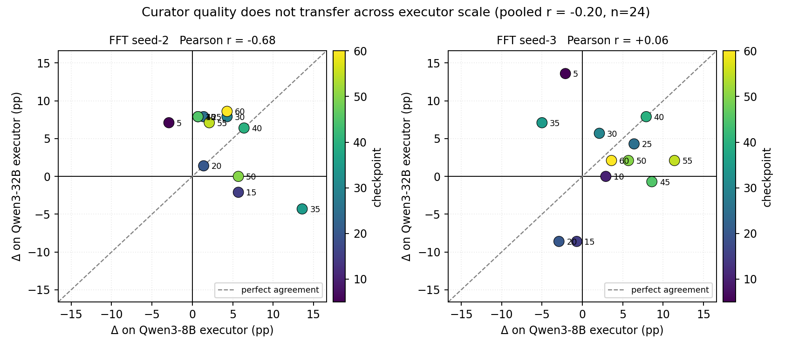
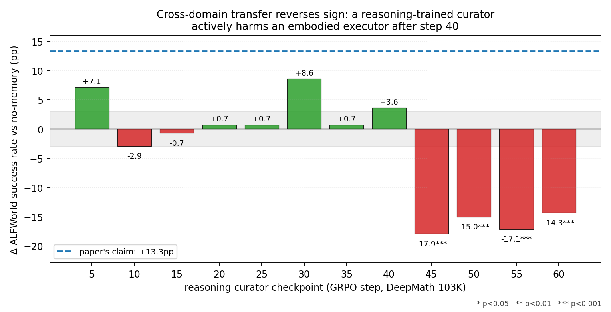
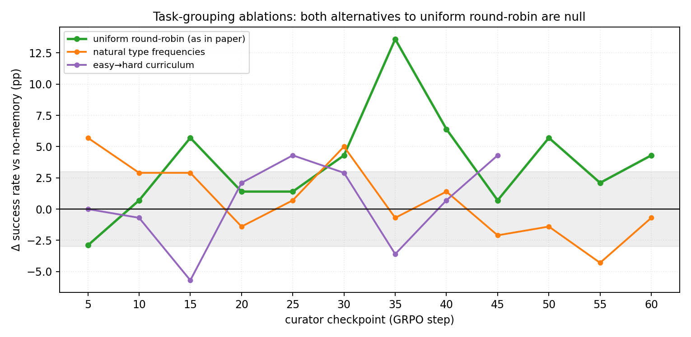

# Reproducing SkillOS: an independent report

An independent reproduction of [SkillOS](https://arxiv.org/abs/2605.06614) (Ouyang et al., 2026) — GRPO-training a *curator* LLM that maintains a markdown skill repo for a frozen *executor* — on 8×H100, in two RL frameworks (TRL and verl-agent/GiGPO), across ALFWorld and three reasoning benchmarks. Roughly two months of 8×H100 wall time and seven full 60-step training runs.

Every number below is recomputed from JSONLs in this repo. Figures regenerate with `.venv/bin/python scripts/make_report_figures.py`.

---

## TL;DR

1. **The method works, but the effect is small and mostly a checkpoint-selection artifact.** Held-out ALFWorld lift is real at *some* checkpoint in every run (+7.1 to +13.6pp), but the curve is non-monotone with 5–14pp swings and the peak index is unstable across seeds (ckpt 20/30/35/55). **No single-checkpoint lift survives correction for the 50 checkpoints we tested.** Report the sweep, not your best arm.
2. **This is not a plumbing artifact.** We reproduced the oscillation in five independent runs and falsified four candidate causes — LoRA-vs-full-FT, TRL-vs-verl, task-type distribution, and within-group curriculum ordering (both halves of the paper's own grouping ablation).
3. **The reward machinery is healthy; the learning is just weak.** Within GRPO groups, downstream task success supplies 79% of the reward variance that reaches the gradient — the optimiser is chasing the right thing. Over 60 steps it moves training task reward by +0.035 (95% CI ±0.034). That, not a broken reward, is why held-out lift is a few points.
4. **Curator quality does not transfer across executor scale.** The best checkpoint for the 8B executor that generated the training data is *not* the best for a 32B executor and can be actively harmful there (pooled r = −0.20 across 24 checkpoint pairs; r = −0.68 within one seed). Our strongest positive result comes from this: an 8B-trained curator lifts Qwen3-32B to **62.9%** (+13.6pp), at parity with the paper's headline 61.2%.
5. **Cross-domain transfer reproduces with the opposite sign.** The paper reports +13.3pp on ALFWorld from a reasoning-trained curator. We measure **−14 to −18pp (p ≤ 0.0005)** at every checkpoint past step 40. These are the only results in the project that survive multiple-comparison correction comfortably.

**Load-bearing caveat.** Our 8B ALFWorld no-memory baseline is 33.6% vs the paper's 47.9%, unexplained after ruling out prompt wording, retrieval, seeds, precision/serving, and decode parameters. Absolute ALFWorld numbers are therefore not comparable to the paper; paired lifts are.

---

## What we ran

| | |
|---|---|
| Curator | Qwen3-8B (as paper) — LoRA r=32 and full fine-tuning |
| Executor | Qwen3-8B frozen during training; tested on Qwen3-8B and Qwen3-32B |
| Judge (`r_cnt`) | Qwen3-32B (as paper) |
| Frameworks | TRL 1.4 + DeepSpeed ZeRO-3 + vLLM colocate; **and** verl-agent/GiGPO + FSDP |
| Hardware | 8×H100 local (curator) + inference.sh remote (executor, judge). Paper: 16 H100 |
| Training runs | 7 × 60 GRPO steps: 1 LoRA, 3 FFT seeds, 2 grouping ablations, 1 verl/GiGPO |
| Held-out protocol | 140 ALFWorld `valid_seen` games, paired-by-gamefile McNemar vs a fixed no-memory baseline |
| Reasoning | AIME24 (30), AIME25 (30), GPQA-Diamond (198) — aggregate accuracies only |

The verl/GiGPO run is the framework-faithful one: real ALFWorld episodes, ground-truth success, BM25 retrieval, judged `r_cnt`, 60/60 steps, ~15,100 executor calls per step, 10.4 days wall.

---

## Finding 1 — held-out lift is real, non-monotone, and does not survive multiplicity

Five independent runs, 140 paired games each, all against the same 33.6% baseline. Every run produces a significant-looking peak somewhere. No two runs peak in the same place. The curve crosses its own baseline repeatedly.

| run | peak | ΔSR | p | ckpt60 | ΔSR |
|---|---|---|---|---|---|
| v8 LoRA r=32 (TRL) | ckpt30 | **+9.3pp** | 0.035 | ckpt60 | +1.4pp |
| FFT seed-1 (TRL) | ckpt20 | **+10.7pp** | 0.032 | ckpt60 | +5.7pp |
| FFT seed-2 (TRL) | ckpt35 | **+13.6pp** | 0.0026 | ckpt60 | +4.3pp |
| FFT seed-3 (TRL) | ckpt55 | **+11.4pp** | 0.011 | ckpt60 | +3.6pp |
| GiGPO (verl, real env) | ckpt30 | **+7.1pp** | 0.099 | ckpt60 | +0.7pp |

Across these five sweeps we ran **50 checkpoint arms** against one baseline. Bonferroni sets the bar at p < 0.001; the best arm in the project is p = 0.0026. **Not one same-executor ALFWorld lift survives.** The peak-lift band (+9 to +14pp) brackets the paper's +13.3pp, so the order of magnitude is plausible — but a single arm from a single sweep is a selection statistic, and the paper's monotone-to-step-60 curve does not appear in any of our runs.

**Four candidate causes falsified** (each a full training run + 140-game sweep):

- *LoRA parameterisation* — full fine-tuning reproduces the shape, slightly stronger.
- *Framework* — verl/GiGPO reproduces the shape (black line above). TRL≠verl was our last-standing suspect; it is now closed.
- *Task-type distribution* — training on natural ALFWorld type frequencies instead of uniform round-robin **kills** the lift (best +5.7pp, p=0.20).
- *Within-group ordering* — the paper's easy→hard curriculum (Table 5) yields no significant lift at any checkpoint (best +4.3pp, p=0.36).

The last two are both halves of the paper's own grouping ablation, so grouping is exonerated as the driver. See [Appendix D](#appendix-d--ablations).

## Finding 2 — the optimiser chases the right signal and still barely moves it

An obvious objection to Finding 1 is that our reward was broken. It wasn't. Decomposing 850 logged rollouts from the verl run: the composite's *level* is dominated by `r_fc` (69%), a near-saturated function-call-validity term — but GRPO centres advantages within each group, so only *within-group variance* reaches the gradient, and there **`r_task` supplies 79%**. All 80 logged groups had non-zero `r_task` variance, so the group-collapse failure mode that invalidated our own earlier runs is genuinely absent here.

Given a healthy task-dominated gradient, training task reward rose from 0.331 to 0.366 over 60 rounds — **+0.035, 95% CI ±0.034**. Downstream train-time success rate was flat (0.170 → 0.167).

What *did* move: policy entropy collapsed 0.139 → 0.035 and grad norm rose 1.40 → 2.40, with the blow-up starting around step 48. The curator sharpens onto a fixed skill-writing style while its effect on the executor plateaus — which is a coherent mechanism for "peak mid-run, drift after."

## Finding 3 — curator quality does not transfer across executor scale

Full every-5 sweeps on both seeds, curator skills driving a Qwen3-32B executor (fresh 49.3% no-memory reference). Per-checkpoint lift on 8B barely predicts lift on 32B: pooled Pearson r = **−0.20** over 24 pairs, and **−0.68** within seed-2, where the on-8B peak (ckpt35, +13.6pp) transfers to **−4.3pp**.

This is also where the paper's headline generalisation claim reproduces:

| curator | 32B abs SR | Δ | p |
|---|---|---|---|
| no memory | 49.3% | — | — |
| **FFT seed-3 ckpt5** | **62.9%** | **+13.6pp** | 0.0043 |
| **v8 LoRA ckpt30** | **62.1%** | **+12.9pp** | 0.0064 |
| paper SkillOS (32B executor) | 61.2% | ~+13pp | — |

Note *which* checkpoints win: seed-3's best 32B curator is **ckpt5** — five GRPO steps in. A barely-trained curator generalises better to a larger executor than a fully-trained one. Practical rule: sweep on your target executor, not your training executor.

## Finding 4 — cross-domain transfer reverses sign

A curator trained on DeepMath-103K, evaluated on ALFWorld. The paper's strongest cross-domain claim is +13.3pp. We see a mild early positive (ckpt30 +8.6pp, p=0.050) and then a cliff: **ckpt45 −17.9pp (p=0.0002), ckpt50 −15.0pp (p=0.0005), ckpt55 −17.1pp (p<0.0001), ckpt60 −14.3pp (p=0.0005)**. Against a 12-arm Bonferroni bar of p<0.0042, all four survive.

Same-domain reasoning curation was separately a null result: no checkpoint beat the 61.2% no-memory aggregate ([Appendix C](#appendix-c--reasoning)). The two together suggest the reasoning curator learned to write skills that are confidently wrong for an embodied executor rather than nothing at all — the most robust single effect we measured, and it points the opposite way from the paper.

---

## What this adds up to

The core method is implementable and does something. A curator trained with GRPO against a composite reward measurably improves a frozen executor, and the improvement is *larger and cleaner on a bigger executor than the one it trained against* — which is the interesting part, and the part that reproduces at the paper's magnitude.

What we cannot support is the reliability implied by a single reported number. Across 50 checkpoints and five runs on the training executor, no lift survives multiplicity correction; the trajectory oscillates; the peak moves with the seed; and the checkpoint that wins on 8B tends to lose on 32B. Anyone building on this should sweep checkpoints on the target executor and report the whole curve.

**Limits.** Our 8B ALFWorld baseline sits 14pp below the paper's and we could not close it (see [Appendix E](#appendix-e--the-baseline-gap)) — absolute comparison is void, paired lifts are fine. n=140 gives a ~±3pp noise floor, so 7pp effects are inherently marginal. WebShop, the paper's third benchmark, was not attempted. Reasoning training ran with ~24% of rollouts hitting rate-limit cuts, a real confound on Appendix C's null.

**Artifacts.** Merged HF checkpoints for both frameworks, all 140-game paired eval JSONLs, and the training code are being released so every McNemar in this report can be recomputed and every claim re-tested on other executors.

---
---

# Appendices

## Appendix A — full ALFWorld sweep tables

All arms: 140 `valid_seen` games, paired by gamefile, McNemar vs `output/eval-pathbv4/no_memory.jsonl` (47/140 = 33.6%). `B-only` = arm solved a game the baseline missed; `A-only` = the reverse.

### verl/GiGPO, real ALFWorld env (`output/eval-verl-gigpo-real/`)

| ckpt | abs SR | Δ | p | | ckpt | abs SR | Δ | p |
|---|---|---|---|---|---|---|---|---|
| 5 | 37.1% | +3.6 | 0.4996 | | 35 | 38.6% | +5.0 | 0.2649 |
| 10 | 39.3% | +5.7 | 0.2005 | | 40 | 39.3% | +5.7 | 0.2005 |
| 15 | 32.1% | −1.4 | 0.8555 | | 45 | 37.1% | +3.6 | 0.4996 |
| 20 | 39.3% | +5.7 | 0.1516 | | 50 | 33.6% | +0.0 | 1.0000 |
| 25 | 34.3% | +0.7 | 1.0000 | | 55 | 40.0% | +6.4 | 0.1496 |
| **30** | **40.7%** | **+7.1** | **0.0987** | | 60 | 34.3% | +0.7 | 1.0000 |

### TRL runs

| ckpt | v8 LoRA | FFT seed-1 | FFT seed-2 | FFT seed-3 |
|---|---|---|---|---|
| 5 | — | — | −2.9 (0.52) | −2.1 (0.68) |
| 10 | −4.3 (0.26) | +7.1 (0.053) | +0.7 (1.00) | +2.9 (0.54) |
| 15 | — | — | +5.7 (0.26) | −0.7 (1.00) |
| 20 | +2.1 (0.71) | **+10.7 (0.032)** | +1.4 (0.85) | −2.9 (0.56) |
| 25 | — | +5.7 (0.20) | +1.4 (0.85) | +6.4 (0.14) |
| 30 | **+9.3 (0.035)** | +0.0 (1.00) | +4.3 (0.36) | +2.1 (0.69) |
| 35 | — | +2.9 (0.60) | **+13.6 (0.0026)** | −5.0 (0.17) |
| 40 | −2.9 (0.57) | +5.0 (0.26) | +6.4 (0.14) | +7.9 (0.061) |
| 45 | — | — | +0.7 (1.00) | +8.6 (0.081) |
| 50 | +4.3 (0.31) | −2.1 (0.72) | +5.7 (0.18) | +5.7 (0.17) |
| 55 | — | — | +2.1 (0.71) | **+11.4 (0.011)** |
| 60 | +1.4 (0.86) | +5.7 (0.18) | +4.3 (0.33) | +3.6 (0.47) |

ΔSR in pp, p in parentheses. Dashes are checkpoints not swept (the LoRA and seed-1 runs predate the every-5 sweep protocol). Artifacts: `output/eval-v8/`, `output/eval-fft/`, `output/eval-fft-seed2/`, `output/eval-fft-seed3/`.

### Per-type breakdown, verl run

Baseline per-type SR: Clean 19% (5/27), Cool 20% (5/25), Heat 25% (4/16), Look 46% (6/13), Pick 60% (21/35), Pick2 25% (6/24). The peak arm (ckpt30) gains almost entirely on the low-baseline types: Clean 19→33%, Cool 20→36%, Heat 25→38%, while Pick2 *drops* 25→17%. Headroom is concentrated in the multi-step types, which is also where the executor's atomic-verb failures live (Appendix E).

## Appendix B — verl/GiGPO training dynamics

60/60 steps, 2026-07-30 → 2026-08-09, 10.4 days wall, ~15,100 remote executor calls per step. Metrics from wandb `output.log` (verl's console metrics are block-buffered through Ray and arrive late or not at all).

| metric | steps 1–10 | steps 50–59 | Δ |
|---|---|---|---|
| composite reward (mean) | 1.402 | 1.443 | +0.041 |
| train success rate | 0.170 | 0.167 | −0.003 |
| policy entropy | 0.139 | 0.035 | **−0.104** |
| grad norm | 1.398 | 2.396 | **+0.998** |
| valid action ratio | 0.950 | 0.993 | +0.043 |
| response length (tokens) | 1051 | 1046 | −4 |

**Reward decomposition** (850 rollouts, paper weights λ_f=1.0, λ_u=0.1, λ_c=0.05):

| component | mean | share of level | **share of within-group variance** |
|---|---|---|---|
| `r_task` | 0.343 | 24.1% | **78.9%** |
| `r_fc` | 0.986 | 69.2% | 15.5% |
| `r_cnt` | 0.498 | 3.5% | 5.5% |
| `r_comp` | 0.936 | 3.3% | 0.1% |

Variance decomposition is Var(total) = Σᵢ Cov(wᵢxᵢ, total), computed within group then pooled over 80 groups (mean 10.6 rollouts/group). The level share is the misleading statistic — a constant offset cancels in the GRPO advantage. `r_task` rounds 1–10 = 0.331, rounds 51–60 = 0.366, Welch t = +2.00 (df 261).

**Step-40 executor outage.** A remote-executor outage zeroed success for one step: 125 minutes of dead air, `r_task` = 0, largest advantage spread in the run (4.426 vs ~2.0 typical), grad norm 1.991. It did **not** propagate — steps 41–48 read 1.52/1.44/1.51/1.54/1.52/1.41/1.35/1.46, and the grad-norm rise starts at step 49. ckpt40 scored 39.3% (+5.7pp) on held-out eval, mid-pack. We considered restarting from ckpt35 and decided against it; the eval vindicated that.

## Appendix C — reasoning

**Baselines** (no-memory, Qwen3-8B, greedy). GPQA-Diamond reported aggregate-only per the dataset access condition.

| dataset | ours | paper | delta |
|---|---|---|---|
| AIME24 | 73.3% (22/30) | 76.0 ± 6.9 | −2.7pp (0.4σ) |
| AIME25 | 60.0% (18/30) | 71.1 ± 10.7 | −11.1pp (1.0σ) |
| GPQA-Diamond | 59.6% (118/198) | 61.8 ± 1.1 | −2.2pp (2.0σ) |
| **average** | **64.3%** | **69.6 ± 4.7** | **−5.3pp (1.1σ)** |

Reasoning baselines reproduce within noise on the same executor stack that is 14pp low on ALFWorld — which is what localises the ALFWorld gap to the environment interaction rather than model quality.

**Same-domain curator training: null.** `reasoningfft`, DeepMath-103K topic-grouped (9 buckets), same recipe as the ALFWorld FFT runs, 60 steps, 49.5h. No checkpoint beats the 61.2% aggregate baseline; best is ckpt30 at −0.8pp. Decomposed, AIME peaks mildly (ckpt30 73.3% vs 66.7% baseline) while GPQA drops 3–7pp at every checkpoint, netting to noise. Confound: 661 HTTP 429s hit ~24% of training rollouts (181 deadline cuts / ~600 positions), vs <5% on the ALFWorld runs.

**Cross-domain → ALFWorld** (`output/eval-reasoning-to-alfworld/`):

| ckpt | 5 | 10 | 15 | 20 | 25 | 30 | 35 | 40 | 45 | 50 | 55 | 60 |
|---|---|---|---|---|---|---|---|---|---|---|---|---|
| ΔSR | +7.1 | −2.9 | −0.7 | +0.7 | +0.7 | +8.6 | +0.7 | +3.6 | **−17.9** | **−15.0** | **−17.1** | **−14.3** |
| p | .11 | .52 | 1.0 | 1.0 | 1.0 | .050 | 1.0 | .47 | **.0002** | **.0005** | **<.0001** | **.0005** |

## Appendix D — ablations

Both halves of the paper's grouping ablation (Table 5), each a full 60-step run + 140-game sweep against the same baseline:

| variant | best arm | ΔSR | p | verdict |
|---|---|---|---|---|
| uniform round-robin (paper default) | ckpt35 | +13.6pp | 0.0026 | reference |
| natural type frequencies | ckpt5 | +5.7pp | 0.20 | **null** |
| easy→hard curriculum (p↑=0.80) | ckpt25/45 | +4.3pp | 0.36 | **null** |

Uniform round-robin's balanced exposure to the low-baseline types (Clean/Cool/Heat) is load-bearing; the Pick-heavy natural distribution spends its budget where there is no headroom. The curriculum sweep covers ckpt5–45 only. Artifacts: `output/eval-fft-natural/`, `output/eval-fft-curriculum/`.

Also ruled out earlier and not re-litigated here: missing KL anchor (β=0.001 is present, and the curve is not a U-shape), executor decode parameters (temp/top_p/top_k sweep, all p>0.5), retrieval, prompt wording (Fig 9 verbatim), and serving precision.

## Appendix E — the baseline gap

Our ALFWorld no-memory baseline is 33.6% vs the paper's 47.9% on nominally the same executor. Ruled out: prompt wording (paper Fig 9 verbatim), retrieval implementation, random seeds, serving precision (local bf16 ≈ remote), and executor decode parameters (full temp/top_p/top_k sweep, all arms p>0.5; GiGPO's top_p=1.0/top_k-off is *worse* for Qwen3).

Remaining suspect, from trace inspection: the ReAct/atomic-verb interaction. Qwen3-8B narrates physical actions (`"I open the microwave and place the item inside"`) instead of emitting ALFWorld's required atomic verb (`heat X with microwave`). Heat SR is 25% on 8B and unlocks to 56–62% on 32B, where the narration failure disappears. The gap concentrates on long-horizon multi-step types. Unresolved.

## Appendix F — divergences from the paper

| # | divergence | status |
|---|---|---|
| 0 | task grouping (distribution + ordering) | **closed** — both halves null, grouping exonerated |
| 1 | 8 H100 + LoRA vs 16 H100 + FFT | closed — FFT runs are the definitive ones |
| 2 | vLLM colocate serving | closed |
| 6 | Algorithm 1 supersedes the earlier Path B design | closed |
| 7 | per-rollout ephemeral skill repo | closed |
| 9 | `max_completion_length` | closed |
| 11 | transfer-probe `r_task` | closed — superseded |
| 14 | TRL ≠ verl framework confound | **closed** — verl/GiGPO reproduces the oscillation |
| 13 | 8B ALFWorld baseline 14pp below paper | **open** — see Appendix E |
| — | WebShop benchmark | **not attempted** |

Full detail and history in [`../DIVERGENCES.md`](../DIVERGENCES.md); dated run-by-run log in [`../JOURNAL.md`](../JOURNAL.md).

## Appendix G — reproducing this

Training:

- ALFWorld (TRL): `scripts/train_algo1.py`, `run_algo1_fft.sh`, `run_algo1_v8_lora_kl.sh`
- ALFWorld (verl/GiGPO): `agent_system/environments/env_package/skillos/` in the verl fork
- Reasoning: `scripts/train_reasoning.py`, `run_reasoning_fft.sh`
- Configs: `configs/alfworld_8xh100_algo1_fft.yaml`, `configs/reasoning_8xh100_algo1_fft.yaml`, `configs/accelerate_zero3.yaml`

Eval and sweeps:

- `scripts/eval_streaming_curation.py --mode {no_memory,closed_loop}` — ALFWorld
- `scripts/eval_reasoning.py --mode no_memory --dataset {aime24,aime25,gpqa}`
- `scripts/compare_eval_arms.py` — the paired-McNemar comparator behind every table here
- `scripts/*_sweep_supervisor.sh` — storm-resilient sweep runners (API gate → GPU-pinned waves → storm detect → comparator)
- `scripts/make_report_figures.py` — regenerates every figure from the artifacts

Any table in this report can be recomputed by pointing `compare_eval_arms.py` at the same arms plus the canonical `output/eval-pathbv4/no_memory.jsonl`.

## References

- Ouyang et al., 2026. *SkillOS: Learning Skill Curation for Self-Evolving Agents.* [arXiv:2605.06614](https://arxiv.org/abs/2605.06614)
- Shao et al., 2024. *Group Relative Policy Optimization.* [arXiv:2402.03300](https://arxiv.org/abs/2402.03300)
- Feng et al., 2025. *verl-agent / GiGPO.* [arXiv:2505.10978](https://arxiv.org/abs/2505.10978)
